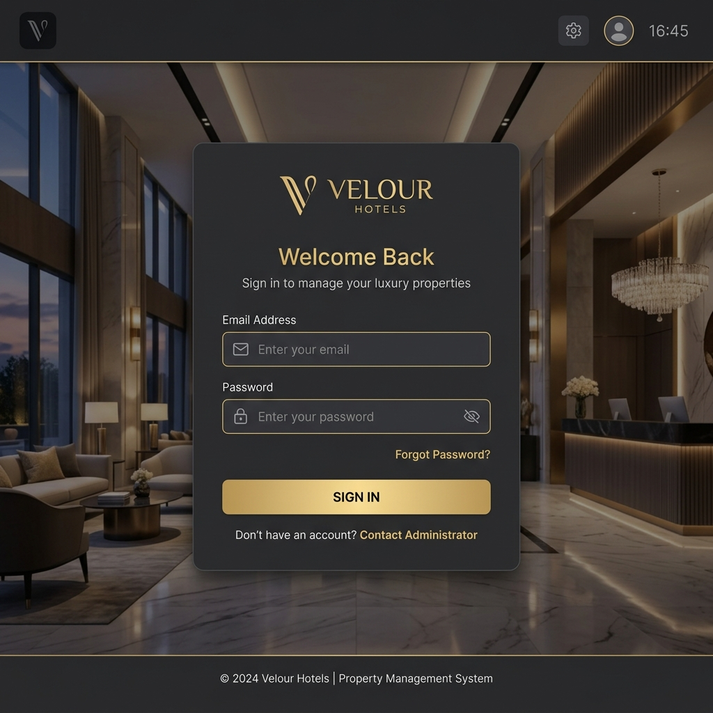
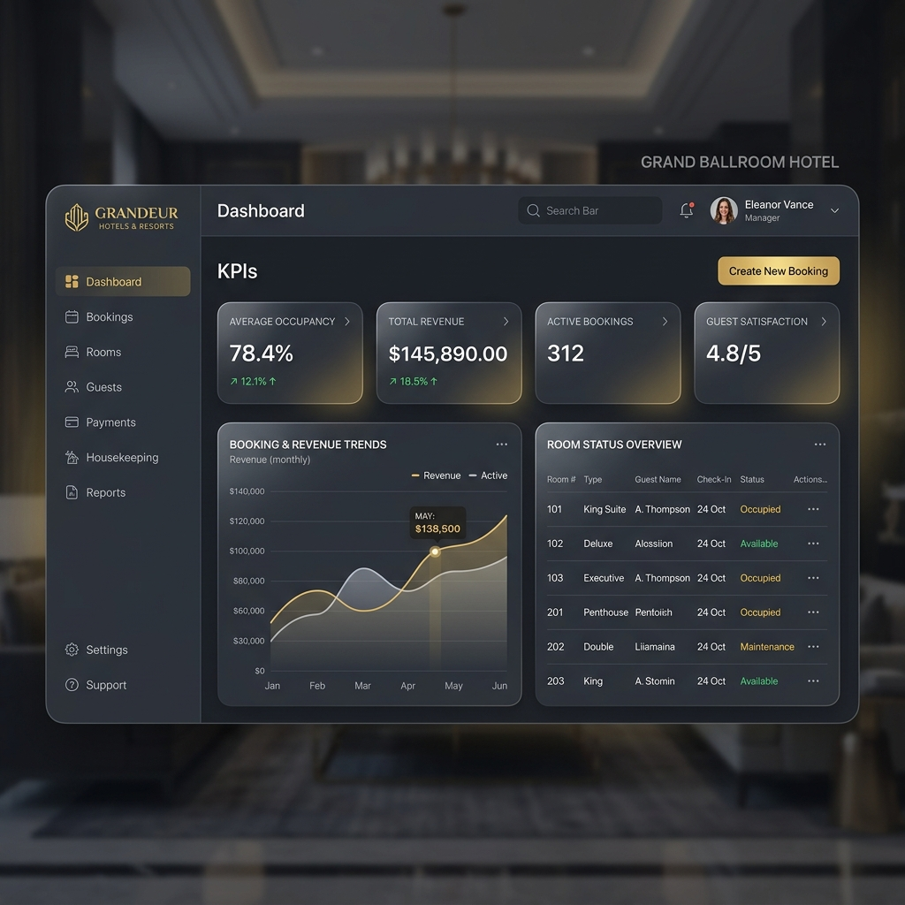
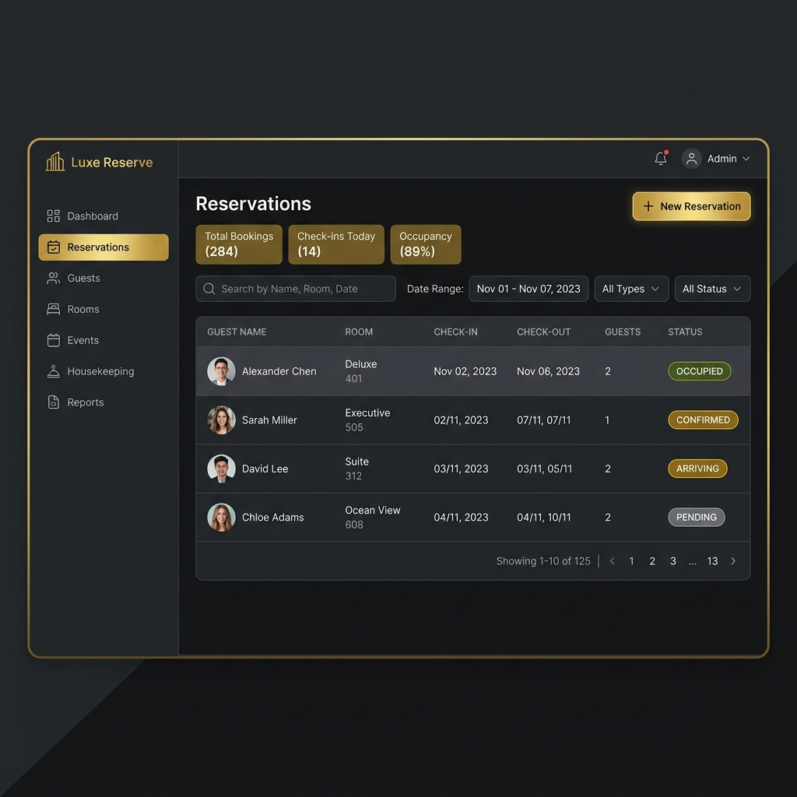
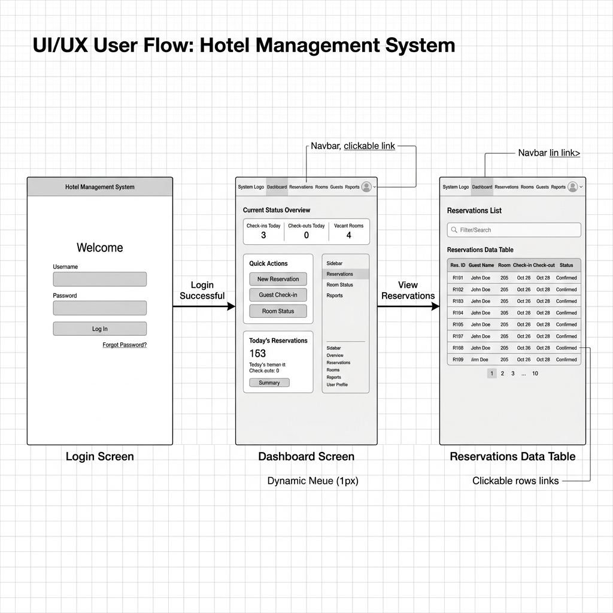
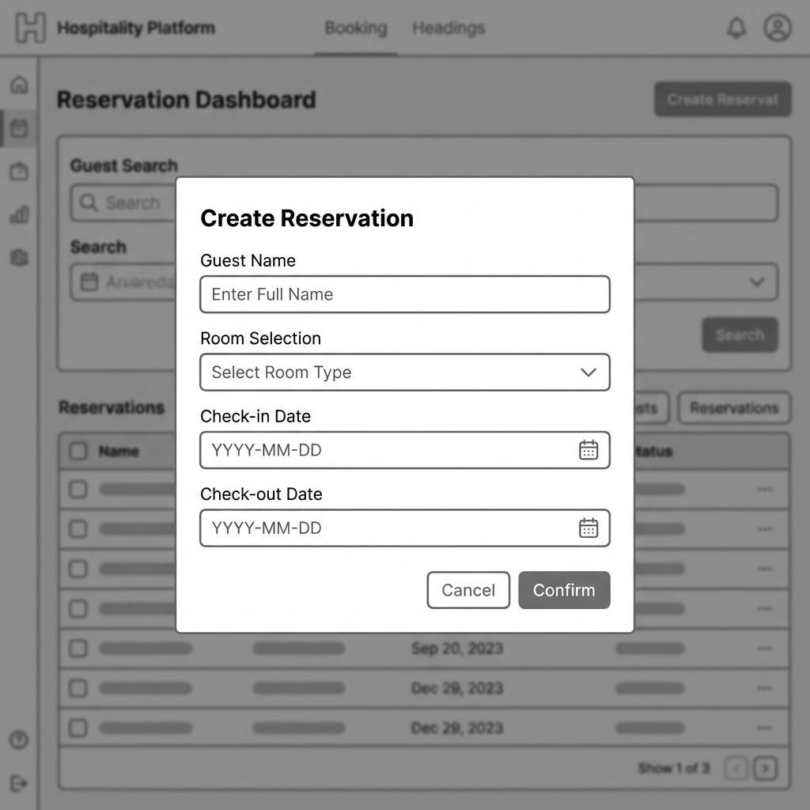

# 🏨 HotelBook Pro

HotelBook Pro es un sistema de gestión hotelera completo que permite administrar reservas, huéspedes, habitaciones, facturación, check-in, check-out y servicios adicionales. Cuenta con una arquitectura en dos capas: un backend robusto construido en Python (Flask) con una base de datos relacional (PostgreSQL/SQLite), y un frontend moderno y dinámico construido en Vue 3 y Tailwind CSS.

---

## 👥 Integrantes

- **Juan Andrés Rojas**
- **Paul Moreno**

---

## 🚀 Arquitectura del Proyecto

El proyecto está dividido en dos partes principales:

- **Backend (API REST):** Ubicado en `app/` y archivos raíz (como `run.py`). Maneja toda la lógica de negocio, autenticación JWT, conexión a base de datos y validaciones de flujo.
- **Frontend (SPA):** Ubicado en el directorio `frontend/`. Construido con Vue 3, Vite, y Tailwind CSS. Se comunica exclusivamente con el backend a través de endpoints REST.

---

## 🛠 Tecnologías Utilizadas

### Backend
- **Python 3.12+**
- **Flask** (Framework web)
- **SQLAlchemy** (ORM)
- **PyJWT** (Autenticación por tokens)
- **SQLite** (Base de datos por defecto, archivo `hotelbook_dev.db`)

### Frontend
- **Vue 3** (Composition API, `<script setup>`)
- **Vite** (Build tool ultra rápida)
- **Tailwind CSS v4** (Framework de estilos de utilidad utilitaria)
- **Pinia** (Manejo de estado global para sesión)
- **Vue Router** (Enrutamiento del lado del cliente)
- **Axios** (Cliente HTTP para consumir la API)

---

## 💻 Instalación y Ejecución Local

### 1. Levantar el Backend (API Flask)

Abre una terminal en la raíz del proyecto y ejecuta:

```bash
# Crear y activar el entorno virtual
python3 -m venv venv
source venv/bin/activate

# Instalar las dependencias
pip install -r requirements.txt

# Iniciar la aplicación en modo desarrollo
python run.py
```
> El backend se levantará en **http://127.0.0.1:5000**

### 2. Levantar el Frontend (Vue 3)

Abre **otra pestaña de terminal** y ejecuta:

```bash
cd frontend

# Instalar dependencias de Node.js
npm install

# Iniciar el servidor de desarrollo
npm run dev
```
> El frontend se levantará en **http://localhost:5173**

---

## 🔑 Credenciales de Acceso

La base de datos incluye usuarios de prueba para desarrollo local. **No uses estas credenciales en producción** y rota/actualiza las contraseñas antes de cualquier despliegue.

| Rol | Email | Contraseña | Descripción y Permisos |
|-----|-------|------------|------------------------|
| **Administrador** | `admin@hotel.com` | *(configurable en seed local)* | Acceso total al sistema. Puede crear habitaciones, eliminar, emitir facturas, etc. |
| **Recepcionista** | `recepcionista@hotel.com` | *(configurable en seed local)* | Gestión operativa: reservas, check-in, check-out, servicios, huéspedes. |
| **Gerente** | `gerente@hotel.com` | *(configurable en seed local)* | Acceso de solo lectura a los Reportes estratégicos (Ocupación e Ingresos). |

---

## 📋 Flujo de Operación (Workflow Principal)

El sistema tiene reglas de negocio estrictas basadas en los requerimientos del hotel. Para realizar un ciclo completo de estadía, sigue este flujo usando la cuenta de **Administrador** o **Recepcionista**:

1. **Gestión de Habitaciones:**
   - Ve a "Habitaciones" y crea una nueva habitación (Tipos válidos: `Simple`, `Doble`, `Suite`, `Deluxe`).
2. **Gestión de Huéspedes:**
   - Ve a "Huéspedes" y registra a un nuevo cliente con sus datos personales.
3. **Creación de Reserva:**
   - Ve a "Reservas" y crea una nueva reserva seleccionando la habitación y el huésped creados anteriormente. La reserva nace en estado **Pendiente**.
4. **Confirmación y Pago de Garantía:**
   - En la tabla de Reservas, presiona "Confirmar". Esto internamente procesa el pago de *garantía (50%)* y cambia el estado a **Confirmada**.
5. **Check-In:**
   - Ve al módulo "Recepción" (pestaña Check-in). Selecciona la reserva confirmada para registrar la llegada del huésped. La reserva pasa a estado **Ocupada**.
6. **Servicios Adicionales (Opcional):**
   - Ve al módulo "Servicios". Como la reserva está "Ocupada", podrás agregarle cargos por Comedor, Spa, Lavandería, etc.
7. **Check-Out y Liquidación:**
   - Vuelve a "Recepción" (pestaña Check-out).
   - Al seleccionar la reserva, el sistema calculará el total restante (saldo de habitación + servicios adicionales).
   - Al confirmar, el sistema automáticamente procesa el pago de *liquidación* y cambia el estado a **Completada**.
8. **Facturación:**
   - Ve a "Facturación". Selecciona la reserva que acaba de completarse y haz clic en "Emitir". El sistema generará la factura oficial y te permitirá descargarla en formato PDF.

---

## 📊 Módulos del Sistema

1. **Autenticación y Sesión:**
   - Control de acceso por roles usando interceptores HTTP y guardias de navegación (`router.beforeEach`). El sidebar de navegación se adapta automáticamente según tu rol.
2. **Habitaciones:**
   - CRUD completo de habitaciones con control de estado (Disponible, Ocupada, Mantenimiento).
3. **Huéspedes:**
   - Directorio de clientes con historial individualizado de sus reservas.
4. **Reservas:**
   - Gestión de disponibilidad por fechas, creación, edición, cancelación y confirmación.
5. **Recepción (Check-in/out):**
   - Control de ingreso y salida con resúmenes financieros automáticos.
6. **Servicios (Spa, Comedor, etc.):**
   - Cargos a la habitación ("Room Service") que se suman dinámicamente a la cuenta final.
7. **Facturación:**
   - Generación, anulación y descarga en formato PDF.
8. **Reportes Estratégicos:**
   - Dashboard analítico exclusivo para Administradores y Gerentes con KPIs de ocupación y cálculo de ingresos totales en un rango de fechas. (Incluye exportación a CSV/PDF en el backend).

---

## 🎨 Diseño y UI

El frontend ha sido diseñado con un estilo moderno, profesional y *premium* (Dark Mode), incluyendo:
- Tonos sobrios (`gray-900`, `gray-800`) con un acento dorado (`#D4AF37`) que transmite exclusividad.
- Micro-animaciones en los botones, tablas y transiciones de estado.
- Interfaz completamente *Responsive*, adaptable a tablets y computadores de escritorio.
- Componentes modulares (`BaseButton`, `BaseTable`, `BaseModal`) para una UI consistente.

### Mockups de Alta Fidelidad
Aquí se presentan los diseños visuales de referencia de la aplicación:

**1. Pantalla de Inicio de Sesión (Login)**


**2. Panel de Control (Dashboard)**


**3. Módulo de Reservas**


### Prototipos (Wireframes)
Estructura y flujo lógico del sistema previo al diseño final:

**1. Flujo de Usuario Principal (User Flow)**


**2. Modal de Creación de Reserva**


---

## 📚 Documentación

Toda la documentación del proyecto (diagramas, guías, especificaciones) está disponible en la carpeta [`docs/`](docs/).

---

## 📄 Licencia

Este proyecto está bajo la **Licencia MIT**. Consulta el archivo [LICENSE](LICENSE) para más detalles.
